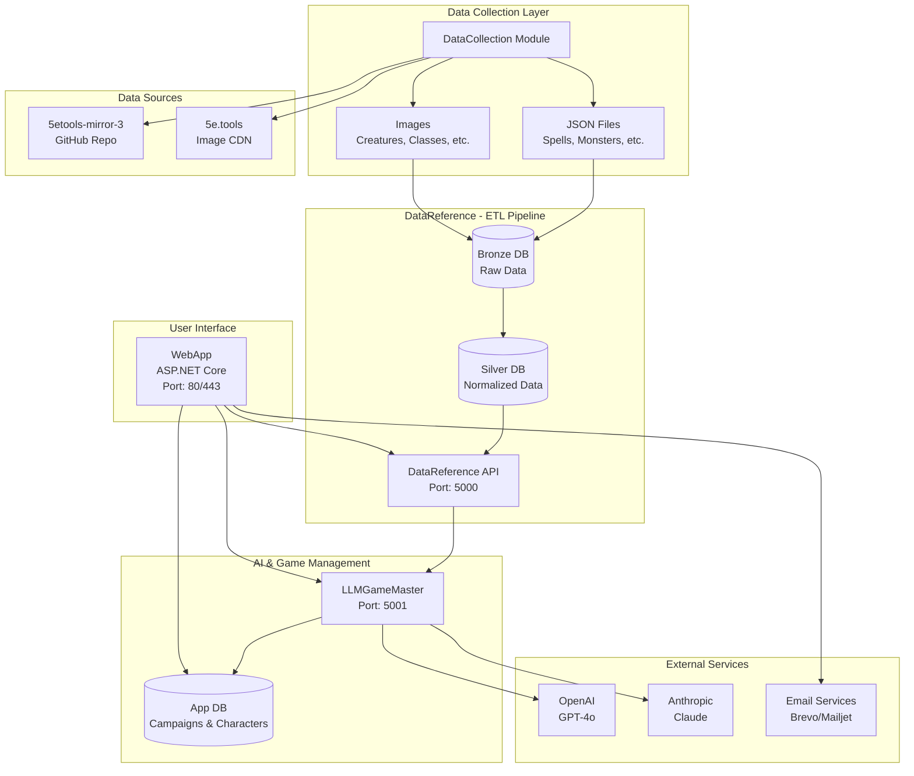

# Architecture Globale - D&D GameMaster AI

## Vue d'ensemble

Le système D&D GameMaster AI est une architecture microservices containerisée haute performance qui transforme des données de référence D&D en une expérience de jeu assistée par intelligence artificielle. Optimisé pour la production avec sécurité enterprise-grade et performances améliorées.

## Diagramme d'architecture



## Flux de données

### 1. Collecte des données (DataCollection)
```
GitHub Repository (5etools-src) → DataCollection → Output Files
5e.tools Images → DataCollection → Local Images
```

### 2. Pipeline ETL (DataReference)
```
Output Files → Bronze DB (Raw) → Silver DB (Normalized) → REST API
```

### 3. Génération IA (LLMGameMaster)
```
User Request → LLMGameMaster → Reference Data API → AI Service → Generated Content
```

### 4. Interface utilisateur (WebApp)
```
User → WebApp → LLMGameMaster → Database → UI Response
```

## Couches d'architecture

### Couche de données (Data Layer)
- **DataCollection**: Collecte automatisée des sources externes
- **Bronze Database**: Stockage brut des données JSON
- **Silver Database**: Données normalisées et optimisées
- **App Database**: Données applicatives (comptes, campagnes)

### Couche services (Service Layer)
- **DataReference API**: Exposition sécurisée des données de référence
- **LLMGameMaster**: Service d'IA pour génération de contenu
- **WebApp**: Interface utilisateur et orchestration

### Couche présentation (Presentation Layer)
- **Web Interface**: Interface responsive HTML/CSS/JS
- **REST APIs**: Endpoints pour communication inter-services

## Sécurité

### Améliorations de sécurité récentes 🔒
- **Git History Sanitization**: Suppression complète des secrets de l'historique Git
- **GitHub Push Protection**: Conformité totale avec la protection des secrets
- **Environment Template System**: Templates sécurisés pour la configuration
- **Enhanced .gitignore**: Exclusion renforcée des fichiers sensibles
- **Security Audit Compliance**: Validation automatique des bonnes pratiques

### Authentification avancée
- **WebApp**: ASP.NET Identity avec cookies sécurisés HttpOnly/Secure
- **APIs internes**: JWT tokens avec rotation et expiration courte
- **Services externes**: Clés API chiffrées et stockées en variables d'environnement
- **Two-Factor Authentication**: Support 2FA optionnel pour les comptes sensibles

### Isolation et contrôle d'accès
- **Conteneurisation**: Chaque service isolé avec utilisateurs non-privilégiés
- **Réseau**: Réseau Docker privé avec segmentation par fonction
- **Base de données**: Utilisateurs séparés avec privilèges minimaux granulaires
- **Rate Limiting**: Protection contre les attaques par déni de service

### Protection des données enterprise-grade
- **Variables sensibles**: Chiffrement au repos et en transit
- **Secrets management**: Rotation automatique des clés avec audit trail
- **Logs sécurisés**: Filtrage et anonymisation des informations sensibles
- **Compliance**: GDPR ready avec gestion des données personnelles

## Performances

### Optimisations critiques récentes 🚀
- **Polling JavaScript optimisé**: Réduction de 96% de la charge serveur (5s → 2min)
- **Gestion d'état améliorée**: Élimination des appels API redondants
- **Protection contre appels simultanés**: Prévention des requêtes concurrentes
- **Cache intelligent**: Mise en cache des données de location et NPCs

### Optimisations base de données
- **Index avancés**: Optimisés pour les requêtes critiques et fréquentes
- **Connection pooling**: Pool de connexions multi-niveaux avec retry
- **Séparation lecture/écriture**: Utilisateurs dédiés par fonction
- **AsNoTracking**: Requêtes optimisées pour les données en lecture seule

### Cache et optimisations frontend
- **API responses**: Cache intelligent avec invalidation sélective
- **Static files**: Compression gzip et cache navigateur longue durée
- **LLM prompts**: Optimisation pour réduire les tokens (coût et latence)
- **Lazy loading**: Chargement différé des éléments non critiques

### Monitoring et métriques avancées
- **Health checks**: Vérification automatique multi-niveaux des services
- **Métriques temps réel**: Suivi des performances et coûts avec alertes
- **Logs structurés**: Facilite l'analyse et le debugging avec corrélation
- **Performance tracking**: Monitoring des temps de réponse par endpoint

## Scalabilité

### Conception modulaire
- **Services indépendants**: Peuvent être scaled individuellement
- **API-first**: Communication par interfaces REST standardisées
- **Stateless**: Services sans état pour faciliter la réplication

### Possibilités d'extension
- **Load balancing**: Réplication des services critiques
- **Cache distribué**: Redis pour cache partagé entre instances
- **CDN**: Distribution des assets statiques

## Configuration et déploiement

### Configuration sécurisée 🔧
- **Environment Templates**: Templates sécurisés dans `ENV_TEMPLATE.md`
- **Secret Management**: Variables sensibles isolées du code source
- **Configuration Validation**: Vérification automatique au démarrage
- **Environment Isolation**: Séparation dev/staging/production stricte

### Variables d'environnement
Chaque service utilise des variables d'environnement sécurisées pour sa configuration :
- **Connexions base de données**: Credentials chiffrés par service
- **Clés API externes**: Rotation automatique des tokens
- **Paramètres de performance**: Optimisations par environnement
- **Features flags**: Activation/désactivation de fonctionnalités

### Orchestration Docker
```yaml
# Configuration simplifiée docker-compose.yml
services:
  datareference_api:    # Port 5000
  llm_gamemaster:       # Port 5001  
  webapp:               # Port 80/443
  databases:            # Ports 5435-5437
```

### Réseau
- **Réseau interne**: Communication sécurisée entre conteneurs
- **Exposition externe**: Seulement WebApp et APIs nécessaires
- **DNS interne**: Résolution automatique des noms de services

## Maintenance et evolution

### Tests et qualité continue
- **CI/CD Pipeline**: Tests automatisés avec feedback immédiat
- **Test Coverage**: Tests unitaires et d'intégration pour tous les modules
- **Quality Gates**: Validation automatique avant déploiement
- **Compatibility Testing**: Vérification des imports et dépendances

### Mises à jour et déploiements
- **Données de référence**: Re-exécution ETL optimisée lors de nouvelles versions D&D
- **Services**: Déploiement indépendant avec rollback automatique
- **Base de données**: Migrations Entity Framework avec validation
- **Zero Downtime**: Déploiements sans interruption de service

### Monitoring et alertes avancées
- **Santé des services**: Health checks multi-niveaux avec diagnostics
- **Coûts IA**: Surveillance intelligente des quotas avec prédiction
- **Performance**: Métriques temps réel avec alertes proactives
- **User Experience**: Monitoring de la satisfaction utilisateur

### Backup et disaster recovery
- **Volumes persistants**: Réplication automatique des données critiques
- **Scripts de sauvegarde**: Automatisation avec vérification d'intégrité
- **Procédures de récupération**: RTO/RPO documentés et testés
- **Business Continuity**: Plans de continuité d'activité validés

## Technologies utilisées

### Backend
- **Python FastAPI**: Services DataReference et LLMGameMaster
- **ASP.NET Core 8**: Application web principale
- **PostgreSQL 14**: Base de données relationnelle
- **Docker & Docker Compose**: Containerisation et orchestration

### Frontend
- **Razor Pages**: Templates côté serveur
- **Bootstrap 5**: Framework CSS responsive
- **jQuery**: Interactions JavaScript
- **Chart.js**: Visualisations et graphiques

### Intelligence artificielle
- **OpenAI GPT-4o**: Modèle principal de génération
- **Anthropic Claude**: Alternative robuste
- **DALL-E**: Génération d'images (optionnel)

### Services externes
- **Brevo/Mailjet**: Services d'email transactionnel
- **GitHub API**: Source des données de référence
- **5e.tools CDN**: Images officielles D&D

## Bonnes pratiques

### Développement
- **Documentation**: Chaque module documenté individuellement
- **Tests**: Tests unitaires et d'intégration
- **Code review**: Validation des changements critiques

### Déploiement
- **Environnements**: Séparation dev/staging/production
- **CI/CD**: Automatisation des déploiements
- **Monitoring**: Surveillance continue des services

### Sécurité
- **Principe du moindre privilège**: Accès minimal nécessaire
- **Rotation des secrets**: Mise à jour périodique des clés
- **Audit logs**: Traçabilité des actions critiques
