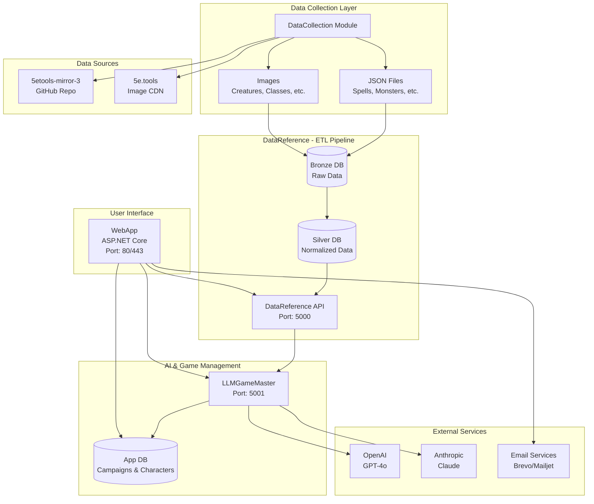

# Architecture Globale - D&D GameMaster AI

## Vue d'ensemble

Le système D&D GameMaster AI est une architecture microservices containerisée qui transforme des données de référence D&D en une expérience de jeu assistée par intelligence artificielle.

## Diagramme d'architecture



## Flux de données

### 1. Collecte des données (DataCollection)
```
GitHub Repository (5etools-src) → DataCollection → Output Files
5e.tools Images → DataCollection → Local Images
```

### 2. Pipeline ETL (DataReference)
```
Output Files → Bronze DB (Raw) → Silver DB (Normalized) → REST API
```

### 3. Génération IA (LLMGameMaster)
```
User Request → LLMGameMaster → Reference Data API → AI Service → Generated Content
```

### 4. Interface utilisateur (WebApp)
```
User → WebApp → LLMGameMaster → Database → UI Response
```

## Couches d'architecture

### Couche de données (Data Layer)
- **DataCollection**: Collecte automatisée des sources externes
- **Bronze Database**: Stockage brut des données JSON
- **Silver Database**: Données normalisées et optimisées
- **App Database**: Données applicatives (comptes, campagnes)

### Couche services (Service Layer)
- **DataReference API**: Exposition sécurisée des données de référence
- **LLMGameMaster**: Service d'IA pour génération de contenu
- **WebApp**: Interface utilisateur et orchestration

### Couche présentation (Presentation Layer)
- **Web Interface**: Interface responsive HTML/CSS/JS
- **REST APIs**: Endpoints pour communication inter-services

## Sécurité

### Authentification
- **WebApp**: ASP.NET Identity avec cookies sécurisés
- **APIs internes**: JWT tokens pour communication inter-services
- **Services externes**: Clés API stockées en variables d'environnement

### Isolation
- **Conteneurisation**: Chaque service dans son propre conteneur
- **Réseau**: Réseau Docker privé pour communication interne
- **Base de données**: Utilisateurs séparés avec privilèges minimaux

### Protection des données
- **Variables sensibles**: Masquées dans la documentation
- **Secrets**: Gestion via Docker secrets ou variables d'environnement
- **Logs**: Filtrage des informations sensibles

## Performances

### Optimisations base de données
- **Index**: Optimisés pour les requêtes fréquentes
- **Connection pooling**: Pool de connexions configuré
- **Séparation lecture/écriture**: Utilisateurs dédiés par fonction

### Cache et optimisations
- **API responses**: Cache des réponses fréquentes
- **Static files**: Compression et cache navigateur
- **LLM prompts**: Optimisation pour réduire les tokens

### Monitoring
- **Health checks**: Vérification automatique des services
- **Métriques**: Suivi des performances et coûts
- **Logs structurés**: Facilite l'analyse et le debugging

## Scalabilité

### Conception modulaire
- **Services indépendants**: Peuvent être scaled individuellement
- **API-first**: Communication par interfaces REST standardisées
- **Stateless**: Services sans état pour faciliter la réplication

### Possibilités d'extension
- **Load balancing**: Réplication des services critiques
- **Cache distribué**: Redis pour cache partagé entre instances
- **CDN**: Distribution des assets statiques

## Configuration et déploiement

### Variables d'environnement
Chaque service utilise des variables d'environnement pour sa configuration :
- Connexions base de données
- Clés API externes
- Paramètres de performance

### Orchestration Docker
```yaml
# Configuration simplifiée docker-compose.yml
services:
  datareference_api:    # Port 5000
  llm_gamemaster:       # Port 5001  
  webapp:               # Port 80/443
  databases:            # Ports 5435-5437
```

### Réseau
- **Réseau interne**: Communication sécurisée entre conteneurs
- **Exposition externe**: Seulement WebApp et APIs nécessaires
- **DNS interne**: Résolution automatique des noms de services

## Maintenance et evolution

### Mises à jour
- **Données de référence**: Re-exécution ETL lors de nouvelles versions D&D
- **Services**: Déploiement indépendant de chaque module
- **Base de données**: Migrations Entity Framework pour WebApp

### Monitoring et alertes
- **Santé des services**: Health checks automatiques
- **Coûts IA**: Surveillance des quotas et budgets
- **Performance**: Métriques de temps de réponse

### Backup et recovery
- **Volumes persistants**: Données critiques préservées
- **Scripts de sauvegarde**: Automatisation des backups
- **Procédures de récupération**: Documentation des étapes de restore

## Technologies utilisées

### Backend
- **Python FastAPI**: Services DataReference et LLMGameMaster
- **ASP.NET Core 8**: Application web principale
- **PostgreSQL 14**: Base de données relationnelle
- **Docker & Docker Compose**: Containerisation et orchestration

### Frontend
- **Razor Pages**: Templates côté serveur
- **Bootstrap 5**: Framework CSS responsive
- **jQuery**: Interactions JavaScript
- **Chart.js**: Visualisations et graphiques

### Intelligence artificielle
- **OpenAI GPT-4o**: Modèle principal de génération
- **Anthropic Claude**: Alternative robuste
- **DALL-E**: Génération d'images (optionnel)

### Services externes
- **Brevo/Mailjet**: Services d'email transactionnel
- **GitHub API**: Source des données de référence
- **5e.tools CDN**: Images officielles D&D

## Bonnes pratiques

### Développement
- **Documentation**: Chaque module documenté individuellement
- **Tests**: Tests unitaires et d'intégration
- **Code review**: Validation des changements critiques

### Déploiement
- **Environnements**: Séparation dev/staging/production
- **CI/CD**: Automatisation des déploiements
- **Monitoring**: Surveillance continue des services

### Sécurité
- **Principe du moindre privilège**: Accès minimal nécessaire
- **Rotation des secrets**: Mise à jour périodique des clés
- **Audit logs**: Traçabilité des actions critiques
